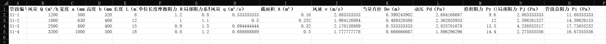
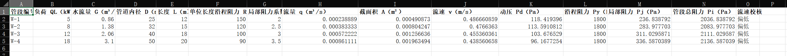
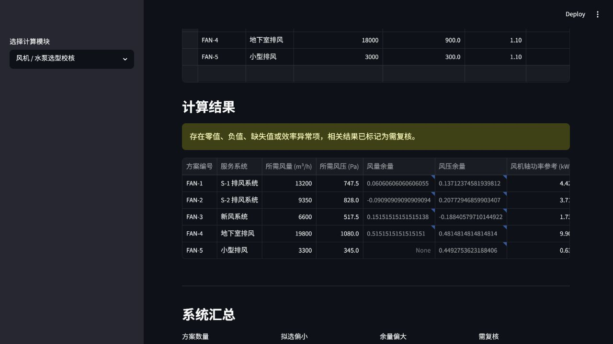
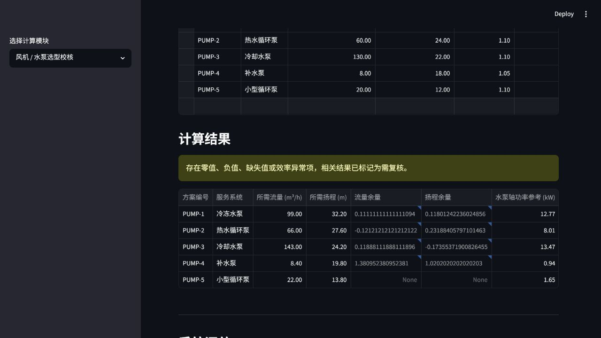
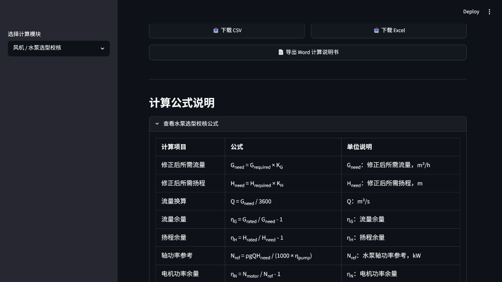

# 建环工程计算工具箱

[](https://github.com/yishidezhangjie666-sys/hvac-duct-hydraulic-calculator/actions/workflows/ci.yml)

> Building Environment Engineering Calculator — 面向建筑环境与能源应用工程的专业计算工具集

## 在线体验

本项目已部署至 Streamlit Community Cloud，可通过以下链接在线访问：

https://hvac-mep-calc-toolbox.streamlit.app/

## 当前版本

当前稳定版本：`v0.2.0`

详见 [CHANGELOG.md](./CHANGELOG.md)。

## 项目简介

建环工程计算工具箱是一个基于 Python + Streamlit 的工程计算工具集，面向建筑环境与能源应用工程、暖通、通风、空调水系统课程设计和工程初步校核。

当前包含通风风管水力计算、空调水系统水力计算、空调末端设备初步选型、冷热源设备初步选型和风机 / 水泵选型校核五个模块，支持 CSV、Excel 和 Word 计算说明书导出，适合课程设计辅助核算、工程初步估算和个人作品集展示。


---

## 项目亮点

- **专业方向明确**：围绕建环 / 暖通常见计算任务设计
- **模块化结构**：modules 与 utils 分离，便于继续扩展
- **多格式导出**：支持 CSV、Excel 和 Word 计算说明书
- **在线部署**：已部署至 Streamlit Community Cloud
- **可扩展性**：后续可继续增加新风负荷深化计算、风机 / 水泵选型校核等模块

---

## 技术栈

- Python
- Streamlit
- pandas
- openpyxl
- python-docx

---

## 适用场景

- 通风工程课程设计
- 空调水系统课程设计
- 风机盘管和新风机组初步选型校核
- 冷热源设备初步选型校核
- 暖通系统初步校核
- 建环专业学生作品集
- 工程计算工具原型开发

---

## 当前已完成

**模块一：通风风管水力计算**

- 支持风量、风速、截面积、当量直径、动压、沿程阻力、局部阻力、系统总阻力计算
- 支持风速校核
- 支持 CSV / Excel / Word 导出

**模块二：空调水系统水力计算**

- 支持根据负荷和供回水温差估算水流量
- 支持管径、流速、动压、沿程阻力、局部阻力、系统总阻力计算
- 支持水泵流量和扬程推荐
- 支持流速校核
- 支持 CSV / Excel / Word 导出

**模块三：空调末端设备初步选型**

- 支持风机盘管冷量、热量和风量余量校核
- 支持新风机组新风冷负荷、机组冷量和风量余量校核
- 支持焓差异常提示，避免负冷负荷误导
- 支持 CSV / Excel / Word 导出
- 结果仅用于学习、课程设计辅助核算和工程初步校核，不能替代正式设备样本选型

**模块四：冷热源设备初步选型**

- 支持风冷热泵机组制冷量、制热量和台数初步校核
- 支持冷水机组制冷量、台数和冷冻水供回水温差初步校核
- 支持锅炉 / 热源设备供热量、台数和供回水温差初步校核
- 支持 CSV / Excel / Word 导出
- 结果仅用于学习、课程设计辅助核算和工程初步校核，不能替代正式设备样本和规范校核

**模块五：风机 / 水泵选型校核**

- 支持风机风量、风压和电机功率参考校核
- 支持水泵流量、扬程和电机功率参考校核
- 支持简化余量判断、校核结果解读和复核建议
- 支持 CSV / Excel / Word 导出
- 结果仅用于学习、课程设计辅助核算和工程初步校核，不能替代正式设备样本和规范校核

---

## 功能说明

- 支持多个矩形风管管段的批量录入
- 可编辑的数据表格，支持增删行
- 自动计算：
  - 风量换算：m³/h → m³/s
  - 风管截面积
  - 风速
  - 当量直径，第一版采用简化水力直径
  - 动压
  - 沿程阻力：单位长度摩擦阻力 R × 管段长度 L
  - 局部阻力
  - 管段总阻力
  - 系统总阻力
- 可调空气密度参数
- 示例数据一键加载
- 空调末端模块可进行风机盘管和新风机组的简化初步选型校核
- 冷热源模块可进行风冷热泵、冷水机组、锅炉 / 热源设备的简化初步选型校核
- 风机 / 水泵模块可进行风机风量、风压和水泵流量、扬程的简化初步选型校核，并给出功率参考和复核建议
- CSV / Excel 导出
- Word 计算说明书导出已统一基础结构，可自动生成包含模块说明、输入参数、计算结果、系统汇总、公式说明和免责声明的 .docx 文件，适合学习、课程设计辅助核算和工程初步校核展示
- 内嵌公式说明，方便截图展示

---

## 示例数据说明

项目示例数据用于展示计算流程和典型校核结果，详见 [示例数据说明](./docs/SAMPLE_DATA_GUIDE.md)。

---

## 校核状态说明

各模块中的“偏低、合适、不足、偏大、明显偏大、需复核”等状态均为简化校核提示，详见 [校核状态说明](./docs/CHECK_GUIDE.md)。
设备选型模块还会在页面中给出简化解读和复核建议，帮助用户从“结果状态”回到“需要复核的输入参数”。
风机 / 水泵选型校核的预研边界见 [风机 / 水泵选型校核预研](./docs/FAN_PUMP_SELECTION_PRESTUDY.md)。

---

## 使用方法

```bash
# 克隆仓库
git clone https://github.com/yishidezhangjie666-sys/hvac-duct-hydraulic-calculator.git
cd hvac-duct-hydraulic-calculator

# 创建虚拟环境
python -m venv .venv

# Windows
.venv\Scripts\activate

# macOS / Linux
# source .venv/bin/activate

# 安装依赖
pip install -r requirements.txt

# 运行
streamlit run app.py
```

启动后在浏览器中打开 http://localhost:8501。

在线部署入口文件：app.py，依赖文件：requirements.txt。

---

## 本地检查

```powershell
.\scripts\check_project.ps1
```

该脚本会执行 Python 编译检查、pytest 测试、Git diff 空白检查和工作区状态检查。

---

## 自动化检查

本项目已配置 GitHub Actions。每次 push 到 main 或创建 pull request 时，会自动运行 Python 编译检查和 pytest 测试，用于降低后续模块维护时误改旧功能的风险。

---

## 计算公式

| 计算项目 | 公式 | 单位说明 |
|---|---|---|
| 风量换算 | Q = Q<sub>h</sub> / 3600 | Q：m³/s，Q<sub>h</sub>：m³/h |
| 截面积 | A = a × b | A：m²，a、b：m |
| 风速 | v = Q / A | v：m/s |
| 水力直径 | D<sub>e</sub> = 2ab / (a + b) | D<sub>e</sub>：m |
| 动压 | P<sub>d</sub> = ρv<sup>2</sup> / 2 | P<sub>d</sub>：Pa，ρ：kg/m³ |
| 沿程阻力 | P<sub>y</sub> = R × L | P<sub>y</sub>：Pa，R：Pa/m，L：m |
| 局部阻力 | P<sub>j</sub> = ζ × P<sub>d</sub> | P<sub>j</sub>：Pa |
| 管段总阻力 | P = P<sub>y</sub> + P<sub>j</sub> | P：Pa |
| 系统总阻力 | ΣP = ΣP<sub>i</sub> | Pa |

---

## 示例输入

| 管段编号 | 风量 (m³/h) | 宽度 (mm) | 高度 (mm) | 长度 (m) | 单位长度摩擦阻力 R (Pa/m) | 局部阻力系数 ζ |
|---|---:|---:|---:|---:|---:|---:|
| S1-1 | 800 | 400 | 250 | 6 | 1.1 | 0.6 |
| S1-2 | 1600 | 500 | 320 | 10 | 1.0 | 0.9 |
| S1-3 | 3200 | 630 | 400 | 14 | 0.9 | 1.2 |
| S1-4 | 4500 | 800 | 500 | 18 | 0.8 | 1.5 |
| S1-5 | 900 | 800 | 500 | 8 | 0.5 | 0.4 |
| S1-6 | 5000 | 500 | 320 | 12 | 1.6 | 2.0 |

## 示例输出

系统总阻力：181.01 Pa

| 管段编号 | 风速 (m/s) | 当量直径 (m) | 动压 (Pa) | 沿程阻力 (Pa) | 局部阻力 (Pa) | 管段总阻力 (Pa) |
|---|---:|---:|---:|---:|---:|---:|
| S1-1 | 2.22 | 0.31 | 2.96 | 6.60 | 1.78 | 8.38 |
| S1-2 | 2.78 | 0.39 | 4.63 | 10.00 | 4.17 | 14.17 |
| S1-3 | 3.53 | 0.49 | 7.47 | 12.60 | 8.96 | 21.56 |
| S1-4 | 3.12 | 0.62 | 5.86 | 14.40 | 8.79 | 23.19 |
| S1-5 | 0.62 | 0.62 | 0.23 | 4.00 | 0.09 | 4.09 |
| S1-6 | 8.68 | 0.39 | 45.21 | 19.20 | 90.42 | 109.62 |

---

## 项目截图

### 首页与模块选择


### 通风风管水力计算结果


### 通风风管公式说明


### 通风风管导出结果



### 空调水系统水力计算结果


### 空调水系统公式说明


### 空调水系统导出结果



### 空调末端设备：风机盘管初步选型


### 空调末端设备：新风机组初步选型


### 空调末端设备公式说明


### 冷热源设备：风冷热泵机组初步选型


### 冷热源设备：冷水机组初步选型


### 冷热源设备：锅炉 / 热源设备初步选型


### 冷热源设备公式说明


### 风机 / 水泵选型校核：风机选型结果



### 风机 / 水泵选型校核：水泵选型结果



### 风机 / 水泵选型校核公式说明



### Word 计算说明书导出


---

## 后续计划

- [x] 增加冷热源设备初步选型模块
- [x] 增加风机盘管和新风机组初步选型模块
- [x] 统一并优化四个模块的 Word 计算说明书导出结构
- [x] 增加更多示例数据和计算校核说明
- [x] 风机 / 水泵选型校核预研与模块设计
- [x] 开发风机 / 水泵选型校核计算函数
- [x] 接入风机 / 水泵选型校核 Streamlit 页面和导出功能

更多下一阶段计划见 [v0.2.0 Roadmap](./docs/ROADMAP_v0.2.0.md)。

---

## 免责声明

本工具采用简化工程计算口径，主要用于学习、课程设计辅助核算和计算流程展示。实际工程设计应结合现行规范、设计手册、设备样本及工程经验进行校核，本工具计算结果不能直接替代正式工程设计。

---

## License

本项目采用 MIT License，详见 LICENSE 文件。
