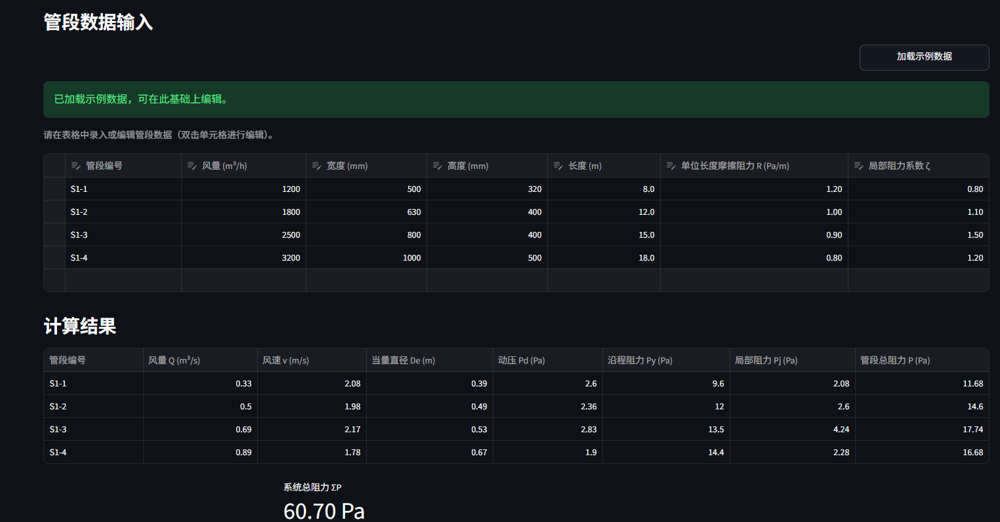

# 建环工程计算工具箱

> Building Environment Engineering Calculator — 面向建筑环境与能源应用工程的计算工具集

---

## 项目简介

建环工程计算工具箱是一个基于 Python + Streamlit 的工程计算工具集，面向建筑环境与能源应用工程、暖通空调及能源动力相关学习和工程计算场景。

### 当前已完成

**模块一：通风风管水力计算**

用于矩形风管系统的简化水力计算，支持多管段录入、自动计算、系统总阻力汇总和 CSV / Excel 导出。

---

## 技术栈

- Python 3.10+
- Streamlit
- pandas
- openpyxl

---

## 功能说明

- 支持多个矩形风管管段的批量录入
- 可编辑的数据表格，支持增删行
- 自动计算：
  - 风量换算：m³/h → m³/s
  - 风管截面积
  - 风速
  - 当量直径，第一版采用简化水力直径
  - 动压
  - 沿程阻力：单位长度摩擦阻力 R × 管段长度 L
  - 局部阻力
  - 管段总阻力
  - 系统总阻力
- 可调空气密度参数
- 示例数据一键加载
- CSV / Excel 导出
- 内嵌公式说明，方便截图展示

---

## 使用方法

```bash
# 克隆仓库
git clone https://github.com/yishidezhangjie666-sys/hvac-duct-hydraulic-calculator.git
cd hvac-duct-hydraulic-calculator

# 创建虚拟环境
python -m venv .venv

# Windows
.venv\Scripts\activate

# macOS / Linux
# source .venv/bin/activate

# 安装依赖
pip install -r requirements.txt

# 运行
streamlit run app.py
```

启动后在浏览器中打开 http://localhost:8501。

---

## 计算公式

| 计算项目 | 公式 | 单位说明 |
|---|---|---|
| 风量换算 | Q = Q<sub>h</sub> / 3600 | Q：m³/s，Q<sub>h</sub>：m³/h |
| 截面积 | A = a × b | A：m²，a、b：m |
| 风速 | v = Q / A | v：m/s |
| 水力直径 | D<sub>e</sub> = 2ab / (a + b) | D<sub>e</sub>：m |
| 动压 | P<sub>d</sub> = ρv<sup>2</sup> / 2 | P<sub>d</sub>：Pa，ρ：kg/m³ |
| 沿程阻力 | P<sub>y</sub> = R × L | P<sub>y</sub>：Pa，R：Pa/m，L：m |
| 局部阻力 | P<sub>j</sub> = ζ × P<sub>d</sub> | P<sub>j</sub>：Pa |
| 管段总阻力 | P = P<sub>y</sub> + P<sub>j</sub> | P：Pa |
| 系统总阻力 | ΣP = ΣP<sub>i</sub> | Pa |

---

## 示例输入

| 管段编号 | 风量 (m³/h) | 宽度 (mm) | 高度 (mm) | 长度 (m) | 单位长度摩擦阻力 R (Pa/m) | 局部阻力系数 ζ |
|---|---:|---:|---:|---:|---:|---:|
| S1-1 | 1200 | 500 | 320 | 8 | 1.2 | 0.8 |
| S1-2 | 1800 | 630 | 400 | 12 | 1.0 | 1.1 |
| S1-3 | 2500 | 800 | 400 | 15 | 0.9 | 1.5 |
| S1-4 | 3200 | 1000 | 500 | 18 | 0.8 | 1.2 |

## 示例输出

系统总阻力：60.70 Pa

| 管段编号 | 风速 (m/s) | 当量直径 (m) | 动压 (Pa) | 沿程阻力 (Pa) | 局部阻力 (Pa) | 管段总阻力 (Pa) |
|---|---:|---:|---:|---:|---:|---:|
| S1-1 | 2.08 | 0.39 | 2.60 | 9.60 | 2.08 | 11.68 |
| S1-2 | 1.98 | 0.49 | 2.36 | 12.00 | 2.60 | 14.60 |
| S1-3 | 2.17 | 0.53 | 2.83 | 13.50 | 4.24 | 17.74 |
| S1-4 | 1.78 | 0.67 | 1.90 | 14.40 | 2.28 | 16.68 |

---

## 项目截图

### 首页界面


### 管段计算结果



### 导出结果


---

## 后续开发计划

### 模块一完善方向

- [ ] 支持圆形风管
- [ ] 增加推荐风速校核
- [ ] 增加局部构件阻力系数库
- [ ] 增加沿程阻力自动计算或查表
- [ ] 增加计算报告导出
- [ ] 增加系统最不利环路分析

### 工具箱扩展模块

- [ ] 空调水系统水力计算
- [ ] 冷热源设备选型
- [ ] 风机 / 水泵选型校核
- [ ] 能耗与运行费用估算
- [ ] Word 计算说明书导出
- [ ] 课程设计案例模板库

---

## 免责声明

本工具采用简化工程计算口径，主要用于学习、课程设计辅助核算和计算流程展示。实际工程设计应结合现行规范、设计手册、设备样本及工程经验进行校核，本工具计算结果不能直接替代正式工程设计。

---

## License

本项目采用 MIT License，详见 LICENSE 文件。
